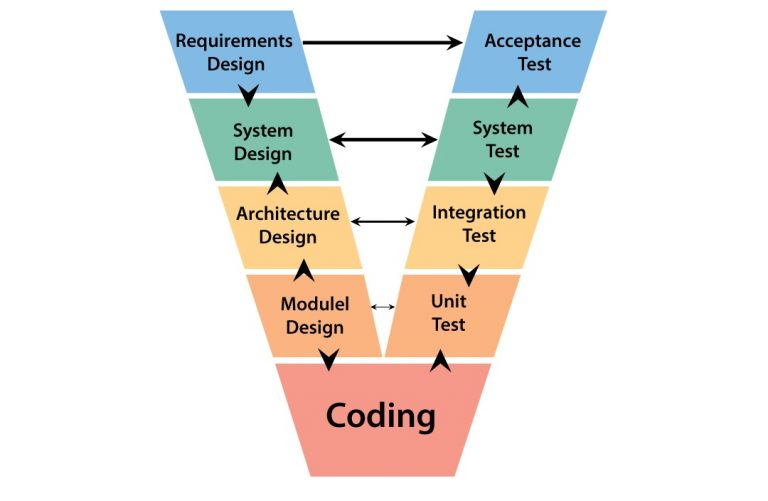
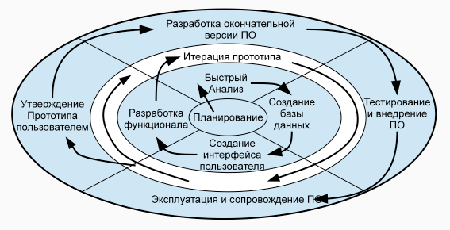

<!-- toc -->

- [CASE-системы (Computer-Aided Software Engineering)](#case-%D1%81%D0%B8%D1%81%D1%82%D0%B5%D0%BC%D1%8B-computer-aided-software-engineering)
    * [Что делает](#%D1%87%D1%82%D0%BE-%D0%B4%D0%B5%D0%BB%D0%B0%D0%B5%D1%82)
    * [Что решает](#%D1%87%D1%82%D0%BE-%D1%80%D0%B5%D1%88%D0%B0%D0%B5%D1%82)
    * [Конкретно как работать с CASE-системой](#%D0%BA%D0%BE%D0%BD%D0%BA%D1%80%D0%B5%D1%82%D0%BD%D0%BE-%D0%BA%D0%B0%D0%BA-%D1%80%D0%B0%D0%B1%D0%BE%D1%82%D0%B0%D1%82%D1%8C-%D1%81-case-%D1%81%D0%B8%D1%81%D1%82%D0%B5%D0%BC%D0%BE%D0%B9)
        + [Сбор и анализ требований](#%D1%81%D0%B1%D0%BE%D1%80-%D0%B8-%D0%B0%D0%BD%D0%B0%D0%BB%D0%B8%D0%B7-%D1%82%D1%80%D0%B5%D0%B1%D0%BE%D0%B2%D0%B0%D0%BD%D0%B8%D0%B9)
        + [Моделирование системы](#%D0%BC%D0%BE%D0%B4%D0%B5%D0%BB%D0%B8%D1%80%D0%BE%D0%B2%D0%B0%D0%BD%D0%B8%D0%B5-%D1%81%D0%B8%D1%81%D1%82%D0%B5%D0%BC%D1%8B)
        + [Трассировка артефактов](#%D1%82%D1%80%D0%B0%D1%81%D1%81%D0%B8%D1%80%D0%BE%D0%B2%D0%BA%D0%B0-%D0%B0%D1%80%D1%82%D0%B5%D1%84%D0%B0%D0%BA%D1%82%D0%BE%D0%B2)
        + [Генерация каркаса кода](#%D0%B3%D0%B5%D0%BD%D0%B5%D1%80%D0%B0%D1%86%D0%B8%D1%8F-%D0%BA%D0%B0%D1%80%D0%BA%D0%B0%D1%81%D0%B0-%D0%BA%D0%BE%D0%B4%D0%B0)
        + [Интеграция с проектными и тестовыми системами](#%D0%B8%D0%BD%D1%82%D0%B5%D0%B3%D1%80%D0%B0%D1%86%D0%B8%D1%8F-%D1%81-%D0%BF%D1%80%D0%BE%D0%B5%D0%BA%D1%82%D0%BD%D1%8B%D0%BC%D0%B8-%D0%B8-%D1%82%D0%B5%D1%81%D1%82%D0%BE%D0%B2%D1%8B%D0%BC%D0%B8-%D1%81%D0%B8%D1%81%D1%82%D0%B5%D0%BC%D0%B0%D0%BC%D0%B8)
        + [Совместная работа и контроль версий](#%D1%81%D0%BE%D0%B2%D0%BC%D0%B5%D1%81%D1%82%D0%BD%D0%B0%D1%8F-%D1%80%D0%B0%D0%B1%D0%BE%D1%82%D0%B0-%D0%B8-%D0%BA%D0%BE%D0%BD%D1%82%D1%80%D0%BE%D0%BB%D1%8C-%D0%B2%D0%B5%D1%80%D1%81%D0%B8%D0%B9)
        + [Документирование и отчёты](#%D0%B4%D0%BE%D0%BA%D1%83%D0%BC%D0%B5%D0%BD%D1%82%D0%B8%D1%80%D0%BE%D0%B2%D0%B0%D0%BD%D0%B8%D0%B5-%D0%B8-%D0%BE%D1%82%D1%87%D1%91%D1%82%D1%8B)
        + [Сопровождение и эволюция](#%D1%81%D0%BE%D0%BF%D1%80%D0%BE%D0%B2%D0%BE%D0%B6%D0%B4%D0%B5%D0%BD%D0%B8%D0%B5-%D0%B8-%D1%8D%D0%B2%D0%BE%D0%BB%D1%8E%D1%86%D0%B8%D1%8F)
- [Язык моделирования UML (Unified Modeling Language)](#%D1%8F%D0%B7%D1%8B%D0%BA-%D0%BC%D0%BE%D0%B4%D0%B5%D0%BB%D0%B8%D1%80%D0%BE%D0%B2%D0%B0%D0%BD%D0%B8%D1%8F-uml-unified-modeling-language)
    * [Диаграмма последовательностей (Sequence Diagram)](#%D0%B4%D0%B8%D0%B0%D0%B3%D1%80%D0%B0%D0%BC%D0%BC%D0%B0-%D0%BF%D0%BE%D1%81%D0%BB%D0%B5%D0%B4%D0%BE%D0%B2%D0%B0%D1%82%D0%B5%D0%BB%D1%8C%D0%BD%D0%BE%D1%81%D1%82%D0%B5%D0%B9-sequence-diagram)
    * [Диаграмма вариантов использования (Use Case Diagram)](#%D0%B4%D0%B8%D0%B0%D0%B3%D1%80%D0%B0%D0%BC%D0%BC%D0%B0-%D0%B2%D0%B0%D1%80%D0%B8%D0%B0%D0%BD%D1%82%D0%BE%D0%B2-%D0%B8%D1%81%D0%BF%D0%BE%D0%BB%D1%8C%D0%B7%D0%BE%D0%B2%D0%B0%D0%BD%D0%B8%D1%8F-use-case-diagram)
    * [Диаграмма классов (доменная модель)](#%D0%B4%D0%B8%D0%B0%D0%B3%D1%80%D0%B0%D0%BC%D0%BC%D0%B0-%D0%BA%D0%BB%D0%B0%D1%81%D1%81%D0%BE%D0%B2-%D0%B4%D0%BE%D0%BC%D0%B5%D0%BD%D0%BD%D0%B0%D1%8F-%D0%BC%D0%BE%D0%B4%D0%B5%D0%BB%D1%8C)
    * [Диаграмма состояний](#%D0%B4%D0%B8%D0%B0%D0%B3%D1%80%D0%B0%D0%BC%D0%BC%D0%B0-%D1%81%D0%BE%D1%81%D1%82%D0%BE%D1%8F%D0%BD%D0%B8%D0%B9)
    * [Диаграмма развёртывания (размещений)](#%D0%B4%D0%B8%D0%B0%D0%B3%D1%80%D0%B0%D0%BC%D0%BC%D0%B0-%D1%80%D0%B0%D0%B7%D0%B2%D1%91%D1%80%D1%82%D1%8B%D0%B2%D0%B0%D0%BD%D0%B8%D1%8F-%D1%80%D0%B0%D0%B7%D0%BC%D0%B5%D1%89%D0%B5%D0%BD%D0%B8%D0%B9)
    * [Диаграмма компонентов](#%D0%B4%D0%B8%D0%B0%D0%B3%D1%80%D0%B0%D0%BC%D0%BC%D0%B0-%D0%BA%D0%BE%D0%BC%D0%BF%D0%BE%D0%BD%D0%B5%D0%BD%D1%82%D0%BE%D0%B2)
    * [4+1 View Model (Модель архитектуры ПО)](#41-view-model-%D0%BC%D0%BE%D0%B4%D0%B5%D0%BB%D1%8C-%D0%B0%D1%80%D1%85%D0%B8%D1%82%D0%B5%D0%BA%D1%82%D1%83%D1%80%D1%8B-%D0%BF%D0%BE)
    * [TODO:](#todo)
- [Производительность ПО. Мониторинг и профилирование](#%D0%BF%D1%80%D0%BE%D0%B8%D0%B7%D0%B2%D0%BE%D0%B4%D0%B8%D1%82%D0%B5%D0%BB%D1%8C%D0%BD%D0%BE%D1%81%D1%82%D1%8C-%D0%BF%D0%BE-%D0%BC%D0%BE%D0%BD%D0%B8%D1%82%D0%BE%D1%80%D0%B8%D0%BD%D0%B3-%D0%B8-%D0%BF%D1%80%D0%BE%D1%84%D0%B8%D0%BB%D0%B8%D1%80%D0%BE%D0%B2%D0%B0%D0%BD%D0%B8%D0%B5)
    * [От чего зависит скорость выполнения ПО](#%D0%BE%D1%82-%D1%87%D0%B5%D0%B3%D0%BE-%D0%B7%D0%B0%D0%B2%D0%B8%D1%81%D0%B8%D1%82-%D1%81%D0%BA%D0%BE%D1%80%D0%BE%D1%81%D1%82%D1%8C-%D0%B2%D1%8B%D0%BF%D0%BE%D0%BB%D0%BD%D0%B5%D0%BD%D0%B8%D1%8F-%D0%BF%D0%BE)
    * [Влияние средств наблюдения на результаты производительности](#%D0%B2%D0%BB%D0%B8%D1%8F%D0%BD%D0%B8%D0%B5-%D1%81%D1%80%D0%B5%D0%B4%D1%81%D1%82%D0%B2-%D0%BD%D0%B0%D0%B1%D0%BB%D1%8E%D0%B4%D0%B5%D0%BD%D0%B8%D1%8F-%D0%BD%D0%B0-%D1%80%D0%B5%D0%B7%D1%83%D0%BB%D1%8C%D1%82%D0%B0%D1%82%D1%8B-%D0%BF%D1%80%D0%BE%D0%B8%D0%B7%D0%B2%D0%BE%D0%B4%D0%B8%D1%82%D0%B5%D0%BB%D1%8C%D0%BD%D0%BE%D1%81%D1%82%D0%B8)
    * [Основные характеристики производительности](#%D0%BE%D1%81%D0%BD%D0%BE%D0%B2%D0%BD%D1%8B%D0%B5-%D1%85%D0%B0%D1%80%D0%B0%D0%BA%D1%82%D0%B5%D1%80%D0%B8%D1%81%D1%82%D0%B8%D0%BA%D0%B8-%D0%BF%D1%80%D0%BE%D0%B8%D0%B7%D0%B2%D0%BE%D0%B4%D0%B8%D1%82%D0%B5%D0%BB%D1%8C%D0%BD%D0%BE%D1%81%D1%82%D0%B8)
    * [Классический "нисходящий" метод поиска уязвивостей в ПО](#%D0%BA%D0%BB%D0%B0%D1%81%D1%81%D0%B8%D1%87%D0%B5%D1%81%D0%BA%D0%B8%D0%B9-%D0%BD%D0%B8%D1%81%D1%85%D0%BE%D0%B4%D1%8F%D1%89%D0%B8%D0%B9-%D0%BC%D0%B5%D1%82%D0%BE%D0%B4-%D0%BF%D0%BE%D0%B8%D1%81%D0%BA%D0%B0-%D1%83%D1%8F%D0%B7%D0%B2%D0%B8%D0%B2%D0%BE%D1%81%D1%82%D0%B5%D0%B9-%D0%B2-%D0%BF%D0%BE)
    * [Диспетчер процессов CPU + виртуальная память + буффер](#%D0%B4%D0%B8%D1%81%D0%BF%D0%B5%D1%82%D1%87%D0%B5%D1%80-%D0%BF%D1%80%D0%BE%D1%86%D0%B5%D1%81%D1%81%D0%BE%D0%B2-cpu--%D0%B2%D0%B8%D1%80%D1%82%D1%83%D0%B0%D0%BB%D1%8C%D0%BD%D0%B0%D1%8F-%D0%BF%D0%B0%D0%BC%D1%8F%D1%82%D1%8C--%D0%B1%D1%83%D1%84%D1%84%D0%B5%D1%80)
    * [Мониторинг Windows/Linux](#%D0%BC%D0%BE%D0%BD%D0%B8%D1%82%D0%BE%D1%80%D0%B8%D0%BD%D0%B3-windowslinux)
    * [Тестовая система для нагрузки + мониторинг JVM + JVM флаги для установки размера различной памяти + профилировщики](#%D1%82%D0%B5%D1%81%D1%82%D0%BE%D0%B2%D0%B0%D1%8F-%D1%81%D0%B8%D1%81%D1%82%D0%B5%D0%BC%D0%B0-%D0%B4%D0%BB%D1%8F-%D0%BD%D0%B0%D0%B3%D1%80%D1%83%D0%B7%D0%BA%D0%B8--%D0%BC%D0%BE%D0%BD%D0%B8%D1%82%D0%BE%D1%80%D0%B8%D0%BD%D0%B3-jvm--jvm-%D1%84%D0%BB%D0%B0%D0%B3%D0%B8-%D0%B4%D0%BB%D1%8F-%D1%83%D1%81%D1%82%D0%B0%D0%BD%D0%BE%D0%B2%D0%BA%D0%B8-%D1%80%D0%B0%D0%B7%D0%BC%D0%B5%D1%80%D0%B0-%D1%80%D0%B0%D0%B7%D0%BB%D0%B8%D1%87%D0%BD%D0%BE%D0%B9-%D0%BF%D0%B0%D0%BC%D1%8F%D1%82%D0%B8--%D0%BF%D1%80%D0%BE%D1%84%D0%B8%D0%BB%D0%B8%D1%80%D0%BE%D0%B2%D1%89%D0%B8%D0%BA%D0%B8)
    * [Что делать если высокий %SYS %IO %Idle %user](#%D1%87%D1%82%D0%BE-%D0%B4%D0%B5%D0%BB%D0%B0%D1%82%D1%8C-%D0%B5%D1%81%D0%BB%D0%B8-%D0%B2%D1%8B%D1%81%D0%BE%D0%BA%D0%B8%D0%B9-%25sys-%25io-%25idle-%25user)
    * [TODO:](#todo-1)
- [_Модель жизненного цикла ПО_ VS _Методология
  разработки_](#_%D0%BC%D0%BE%D0%B4%D0%B5%D0%BB%D1%8C-%D0%B6%D0%B8%D0%B7%D0%BD%D0%B5%D0%BD%D0%BD%D0%BE%D0%B3%D0%BE-%D1%86%D0%B8%D0%BA%D0%BB%D0%B0-%D0%BF%D0%BE_-vs-_%D0%BC%D0%B5%D1%82%D0%BE%D0%B4%D0%BE%D0%BB%D0%BE%D0%B3%D0%B8%D1%8F-%D1%80%D0%B0%D0%B7%D1%80%D0%B0%D0%B1%D0%BE%D1%82%D0%BA%D0%B8_)
- [Модель жизненного цикла ПО (ЖЦП)](#%D0%BC%D0%BE%D0%B4%D0%B5%D0%BB%D1%8C-%D0%B6%D0%B8%D0%B7%D0%BD%D0%B5%D0%BD%D0%BD%D0%BE%D0%B3%D0%BE-%D1%86%D0%B8%D0%BA%D0%BB%D0%B0-%D0%BF%D0%BE-%D0%B6%D1%86%D0%BF)
    * [Зачем нужна модель ЖЦП](#%D0%B7%D0%B0%D1%87%D0%B5%D0%BC-%D0%BD%D1%83%D0%B6%D0%BD%D0%B0-%D0%BC%D0%BE%D0%B4%D0%B5%D0%BB%D1%8C-%D0%B6%D1%86%D0%BF)
    * [Базовые Фазы любого проекта](#%D0%B1%D0%B0%D0%B7%D0%BE%D0%B2%D1%8B%D0%B5-%D1%84%D0%B0%D0%B7%D1%8B-%D0%BB%D1%8E%D0%B1%D0%BE%D0%B3%D0%BE-%D0%BF%D1%80%D0%BE%D0%B5%D0%BA%D1%82%D0%B0)
    * [Waterfall (Каскадная модель)](#waterfall-%D0%BA%D0%B0%D1%81%D0%BA%D0%B0%D0%B4%D0%BD%D0%B0%D1%8F-%D0%BC%D0%BE%D0%B4%D0%B5%D0%BB%D1%8C)
        + [История](#%D0%B8%D1%81%D1%82%D0%BE%D1%80%D0%B8%D1%8F)
        + [Как работает](#%D0%BA%D0%B0%D0%BA-%D1%80%D0%B0%D0%B1%D0%BE%D1%82%D0%B0%D0%B5%D1%82)
        + [Проблемы модели](#%D0%BF%D1%80%D0%BE%D0%B1%D0%BB%D0%B5%D0%BC%D1%8B-%D0%BC%D0%BE%D0%B4%D0%B5%D0%BB%D0%B8)
        + [Применение](#%D0%BF%D1%80%D0%B8%D0%BC%D0%B5%D0%BD%D0%B5%D0%BD%D0%B8%D0%B5)
        + [Развитие модели](#%D1%80%D0%B0%D0%B7%D0%B2%D0%B8%D1%82%D0%B8%D0%B5-%D0%BC%D0%BE%D0%B4%D0%B5%D0%BB%D0%B8)
    * [Модель Ройса](#%D0%BC%D0%BE%D0%B4%D0%B5%D0%BB%D1%8C-%D1%80%D0%BE%D0%B9%D1%81%D0%B0)
        + [История](#%D0%B8%D1%81%D1%82%D0%BE%D1%80%D0%B8%D1%8F-1)
        + [Как работает](#%D0%BA%D0%B0%D0%BA-%D1%80%D0%B0%D0%B1%D0%BE%D1%82%D0%B0%D0%B5%D1%82-1)
        + [Проблемы модели](#%D0%BF%D1%80%D0%BE%D0%B1%D0%BB%D0%B5%D0%BC%D1%8B-%D0%BC%D0%BE%D0%B4%D0%B5%D0%BB%D0%B8-1)
        + [Применение](#%D0%BF%D1%80%D0%B8%D0%BC%D0%B5%D0%BD%D0%B5%D0%BD%D0%B8%D0%B5-1)
    * [V-модель](#v-%D0%BC%D0%BE%D0%B4%D0%B5%D0%BB%D1%8C)
        + [История](#%D0%B8%D1%81%D1%82%D0%BE%D1%80%D0%B8%D1%8F-2)
        + [Как работает](#%D0%BA%D0%B0%D0%BA-%D1%80%D0%B0%D0%B1%D0%BE%D1%82%D0%B0%D0%B5%D1%82-2)
        + [Проблемы модели](#%D0%BF%D1%80%D0%BE%D0%B1%D0%BB%D0%B5%D0%BC%D1%8B-%D0%BC%D0%BE%D0%B4%D0%B5%D0%BB%D0%B8-2)
        + [Применение](#%D0%BF%D1%80%D0%B8%D0%BC%D0%B5%D0%BD%D0%B5%D0%BD%D0%B8%D0%B5-2)
    * [Incremental (Инкрементная модель, Многопроходная модель)](#incremental-%D0%B8%D0%BD%D0%BA%D1%80%D0%B5%D0%BC%D0%B5%D0%BD%D1%82%D0%BD%D0%B0%D1%8F-%D0%BC%D0%BE%D0%B4%D0%B5%D0%BB%D1%8C-%D0%BC%D0%BD%D0%BE%D0%B3%D0%BE%D0%BF%D1%80%D0%BE%D1%85%D0%BE%D0%B4%D0%BD%D0%B0%D1%8F-%D0%BC%D0%BE%D0%B4%D0%B5%D0%BB%D1%8C)
        + [История](#%D0%B8%D1%81%D1%82%D0%BE%D1%80%D0%B8%D1%8F-3)
        + [Как работает](#%D0%BA%D0%B0%D0%BA-%D1%80%D0%B0%D0%B1%D0%BE%D1%82%D0%B0%D0%B5%D1%82-3)
        + [Проблемы модели](#%D0%BF%D1%80%D0%BE%D0%B1%D0%BB%D0%B5%D0%BC%D1%8B-%D0%BC%D0%BE%D0%B4%D0%B5%D0%BB%D0%B8-3)
        + [Применение](#%D0%BF%D1%80%D0%B8%D0%BC%D0%B5%D0%BD%D0%B5%D0%BD%D0%B8%D0%B5-3)
    * [Модель прототипирования](#%D0%BC%D0%BE%D0%B4%D0%B5%D0%BB%D1%8C-%D0%BF%D1%80%D0%BE%D1%82%D0%BE%D1%82%D0%B8%D0%BF%D0%B8%D1%80%D0%BE%D0%B2%D0%B0%D0%BD%D0%B8%D1%8F)
        + [История](#%D0%B8%D1%81%D1%82%D0%BE%D1%80%D0%B8%D1%8F-4)
        + [Как работает](#%D0%BA%D0%B0%D0%BA-%D1%80%D0%B0%D0%B1%D0%BE%D1%82%D0%B0%D0%B5%D1%82-4)
        + [Проблемы модели](#%D0%BF%D1%80%D0%BE%D0%B1%D0%BB%D0%B5%D0%BC%D1%8B-%D0%BC%D0%BE%D0%B4%D0%B5%D0%BB%D0%B8-4)
        + [Применение](#%D0%BF%D1%80%D0%B8%D0%BC%D0%B5%D0%BD%D0%B5%D0%BD%D0%B8%D0%B5-4)
    * [Спиральная модель](#%D1%81%D0%BF%D0%B8%D1%80%D0%B0%D0%BB%D1%8C%D0%BD%D0%B0%D1%8F-%D0%BC%D0%BE%D0%B4%D0%B5%D0%BB%D1%8C)
        + [История](#%D0%B8%D1%81%D1%82%D0%BE%D1%80%D0%B8%D1%8F-5)
        + [Как работает](#%D0%BA%D0%B0%D0%BA-%D1%80%D0%B0%D0%B1%D0%BE%D1%82%D0%B0%D0%B5%D1%82-5)
        + [Проблемы модели](#%D0%BF%D1%80%D0%BE%D0%B1%D0%BB%D0%B5%D0%BC%D1%8B-%D0%BC%D0%BE%D0%B4%D0%B5%D0%BB%D0%B8-5)
        + [Применение](#%D0%BF%D1%80%D0%B8%D0%BC%D0%B5%D0%BD%D0%B5%D0%BD%D0%B8%D0%B5-5)
    * [**Итерационная (Iterative)
      **](#%D0%B8%D1%82%D0%B5%D1%80%D0%B0%D1%86%D0%B8%D0%BE%D0%BD%D0%BD%D0%B0%D1%8F-iterative)
    * [**Спиральная (Spiral)**](#%D1%81%D0%BF%D0%B8%D1%80%D0%B0%D0%BB%D1%8C%D0%BD%D0%B0%D1%8F-spiral)
    * [**Big Bang (Большой взрыв)
      **](#big-bang-%D0%B1%D0%BE%D0%BB%D1%8C%D1%88%D0%BE%D0%B9-%D0%B2%D0%B7%D1%80%D1%8B%D0%B2)
    * [**RAD (Rapid Application Development)**](#rad-rapid-application-development)
    * [**Concurrent / Параллельная модель
      **](#concurrent--%D0%BF%D0%B0%D1%80%D0%B0%D0%BB%D0%BB%D0%B5%D0%BB%D1%8C%D0%BD%D0%B0%D1%8F-%D0%BC%D0%BE%D0%B4%D0%B5%D0%BB%D1%8C)
    * [**DevOps / Непрерывный цикл (Continuous Delivery)
      **](#devops--%D0%BD%D0%B5%D0%BF%D1%80%D0%B5%D1%80%D1%8B%D0%B2%D0%BD%D1%8B%D0%B9-%D1%86%D0%B8%D0%BA%D0%BB-continuous-delivery)
    * [Стандарт: **ISO/IEC 12207-2008 / ГОСТ Р ИСО/МЭК 12207-2010
      **](#%D1%81%D1%82%D0%B0%D0%BD%D0%B4%D0%B0%D1%80%D1%82-isoiec-12207-2008--%D0%B3%D0%BE%D1%81%D1%82-%D1%80-%D0%B8%D1%81%D0%BE%D0%BC%D1%8D%D0%BA-12207-2010)
- [Методологии разработки ПО](#%D0%BC%D0%B5%D1%82%D0%BE%D0%B4%D0%BE%D0%BB%D0%BE%D0%B3%D0%B8%D0%B8-%D1%80%D0%B0%D0%B7%D1%80%D0%B0%D0%B1%D0%BE%D1%82%D0%BA%D0%B8-%D0%BF%D0%BE)
    * [Agile](#agile)
        + [История](#%D0%B8%D1%81%D1%82%D0%BE%D1%80%D0%B8%D1%8F-6)
        + [Ценности Agile (из Манифеста)](#%D1%86%D0%B5%D0%BD%D0%BD%D0%BE%D1%81%D1%82%D0%B8-agile-%D0%B8%D0%B7-%D0%BC%D0%B0%D0%BD%D0%B8%D1%84%D0%B5%D1%81%D1%82%D0%B0)
        + [12 принципов Agile](#12-%D0%BF%D1%80%D0%B8%D0%BD%D1%86%D0%B8%D0%BF%D0%BE%D0%B2-agile)
        + [Как работает Agile](#%D0%BA%D0%B0%D0%BA-%D1%80%D0%B0%D0%B1%D0%BE%D1%82%D0%B0%D0%B5%D1%82-agile)
        + [Преимущества Agile](#%D0%BF%D1%80%D0%B5%D0%B8%D0%BC%D1%83%D1%89%D0%B5%D1%81%D1%82%D0%B2%D0%B0-agile)
        + [Ограничения и риски](#%D0%BE%D0%B3%D1%80%D0%B0%D0%BD%D0%B8%D1%87%D0%B5%D0%BD%D0%B8%D1%8F-%D0%B8-%D1%80%D0%B8%D1%81%D0%BA%D0%B8)
        + [Инструменты поддержки Agile](#%D0%B8%D0%BD%D1%81%D1%82%D1%80%D1%83%D0%BC%D0%B5%D0%BD%D1%82%D1%8B-%D0%BF%D0%BE%D0%B4%D0%B4%D0%B5%D1%80%D0%B6%D0%BA%D0%B8-agile)
    * [Rational Unified Process (RUP)](#rational-unified-process-rup)
        + [4 фазы жизненного цикла](#4-%D1%84%D0%B0%D0%B7%D1%8B-%D0%B6%D0%B8%D0%B7%D0%BD%D0%B5%D0%BD%D0%BD%D0%BE%D0%B3%D0%BE-%D1%86%D0%B8%D0%BA%D0%BB%D0%B0)
        + [9 дисциплин (workflows)](#9-%D0%B4%D0%B8%D1%81%D1%86%D0%B8%D0%BF%D0%BB%D0%B8%D0%BD-workflows)
        + [Преимущества](#%D0%BF%D1%80%D0%B5%D0%B8%D0%BC%D1%83%D1%89%D0%B5%D1%81%D1%82%D0%B2%D0%B0)
        + [Недостатки](#%D0%BD%D0%B5%D0%B4%D0%BE%D1%81%D1%82%D0%B0%D1%82%D0%BA%D0%B8)
        + [Роли в RUP](#%D1%80%D0%BE%D0%BB%D0%B8-%D0%B2-rup)
        + [Основные принципы RUP](#%D0%BE%D1%81%D0%BD%D0%BE%D0%B2%D0%BD%D1%8B%D0%B5-%D0%BF%D1%80%D0%B8%D0%BD%D1%86%D0%B8%D0%BF%D1%8B-rup)
    * [Rapid Application Development (RAD)](#rapid-application-development-rad)
    * [Scrum](#scrum)
        + [Роли](#%D1%80%D0%BE%D0%BB%D0%B8)
        + [Артефакты Scrum](#%D0%B0%D1%80%D1%82%D0%B5%D1%84%D0%B0%D0%BA%D1%82%D1%8B-scrum)
        + [Церемонии (события) Scrum](#%D1%86%D0%B5%D1%80%D0%B5%D0%BC%D0%BE%D0%BD%D0%B8%D0%B8-%D1%81%D0%BE%D0%B1%D1%8B%D1%82%D0%B8%D1%8F-scrum)
        + [Основные элементы](#%D0%BE%D1%81%D0%BD%D0%BE%D0%B2%D0%BD%D1%8B%D0%B5-%D1%8D%D0%BB%D0%B5%D0%BC%D0%B5%D0%BD%D1%82%D1%8B)
        + [Процесс спринта](#%D0%BF%D1%80%D0%BE%D1%86%D0%B5%D1%81%D1%81-%D1%81%D0%BF%D1%80%D0%B8%D0%BD%D1%82%D0%B0)
        + [Преимущества Scrum](#%D0%BF%D1%80%D0%B5%D0%B8%D0%BC%D1%83%D1%89%D0%B5%D1%81%D1%82%D0%B2%D0%B0-scrum)
    * [Disciplined Agile Delivery (DAD)](#disciplined-agile-delivery-dad)
        + [История](#%D0%B8%D1%81%D1%82%D0%BE%D1%80%D0%B8%D1%8F-7)
        + [Когда использовать?](#%D0%BA%D0%BE%D0%B3%D0%B4%D0%B0-%D0%B8%D1%81%D0%BF%D0%BE%D0%BB%D1%8C%D0%B7%D0%BE%D0%B2%D0%B0%D1%82%D1%8C)
        + [Основные фазы](#%D0%BE%D1%81%D0%BD%D0%BE%D0%B2%D0%BD%D1%8B%D0%B5-%D1%84%D0%B0%D0%B7%D1%8B)
        + [Ключевые дисциплины (process goals)](#%D0%BA%D0%BB%D1%8E%D1%87%D0%B5%D0%B2%D1%8B%D0%B5-%D0%B4%D0%B8%D1%81%D1%86%D0%B8%D0%BF%D0%BB%D0%B8%D0%BD%D1%8B-process-goals)
        + [Преимущества и когда применять](#%D0%BF%D1%80%D0%B5%D0%B8%D0%BC%D1%83%D1%89%D0%B5%D1%81%D1%82%D0%B2%D0%B0-%D0%B8-%D0%BA%D0%BE%D0%B3%D0%B4%D0%B0-%D0%BF%D1%80%D0%B8%D0%BC%D0%B5%D0%BD%D1%8F%D1%82%D1%8C)
- [Модель FURPS+](#%D0%BC%D0%BE%D0%B4%D0%B5%D0%BB%D1%8C-furps)
    * [Основные компоненты FURPS+](#%D0%BE%D1%81%D0%BD%D0%BE%D0%B2%D0%BD%D1%8B%D0%B5-%D0%BA%D0%BE%D0%BC%D0%BF%D0%BE%D0%BD%D0%B5%D0%BD%D1%82%D1%8B-furps)
        + [1. Functional — Функциональные требования](#1-functional--%D1%84%D1%83%D0%BD%D0%BA%D1%86%D0%B8%D0%BE%D0%BD%D0%B0%D0%BB%D1%8C%D0%BD%D1%8B%D0%B5-%D1%82%D1%80%D0%B5%D0%B1%D0%BE%D0%B2%D0%B0%D0%BD%D0%B8%D1%8F)
        + [2. Nonfunctional — Нефункциональные требования](#2-nonfunctional--%D0%BD%D0%B5%D1%84%D1%83%D0%BD%D0%BA%D1%86%D0%B8%D0%BE%D0%BD%D0%B0%D0%BB%D1%8C%D0%BD%D1%8B%D0%B5-%D1%82%D1%80%D0%B5%D0%B1%D0%BE%D0%B2%D0%B0%D0%BD%D0%B8%D1%8F)
        + [3. Дополнительные категории: **"+"
          **](#3-%D0%B4%D0%BE%D0%BF%D0%BE%D0%BB%D0%BD%D0%B8%D1%82%D0%B5%D0%BB%D1%8C%D0%BD%D1%8B%D0%B5-%D0%BA%D0%B0%D1%82%D0%B5%D0%B3%D0%BE%D1%80%D0%B8%D0%B8-)
    * [Стандарт](#%D1%81%D1%82%D0%B0%D0%BD%D0%B4%D0%B0%D1%80%D1%82)
    * [Пример применения](#%D0%BF%D1%80%D0%B8%D0%BC%D0%B5%D1%80-%D0%BF%D1%80%D0%B8%D0%BC%D0%B5%D0%BD%D0%B5%D0%BD%D0%B8%D1%8F)

<!-- tocstop -->

# CASE-системы (Computer-Aided Software Engineering)

**CASE-системы** — это программные инструменты, которые автоматизируют и упрощают
различные этапы разработки ПО. CASE-системы делают «из скучной бумажной работы» единый автоматизированный процесс, где
модель и код живут синхронно, а команда не теряет времени на согласование артефактов вручную.

## Что делает

- Анализ и моделирование требований (UML-диаграммы, ER-диаграммы, BPMN)
- Управляют требованиями и трассировкой артефактов
- Генерация первичного кода (каркас) по моделям
- Координируют работу команды через единый репозиторий артефактов
- Интеграция с:
    - Системами тестирования
    - Управлением проектами
- Используются в **RAD и других методологиях**.
- Поддерживают **весь жизненный цикл разработки ПО**.

## Что решает

- Снижают рутинную работу: автоматический перенос изменений из модели в исходники
- Единое хранилище: все диаграммы, требования и документы под одним «зонтиком»
- Повышают прозрачность: любой член команды видит актуальную модель системы
- Ускоряют старт проекта: типовые шаблоны и генераторы каркаса

## Конкретно как работать с CASE-системой

### Сбор и анализ требований

- Вводите требования в хранилище:
    - Пишите текстовые описания в виде «User Story» или «Use Case».
    - Добавляете атрибуты (приоритет, статус, источник, связанная бизнес-цель).
- Формируете иерархию:
    - Группируете требования по модулям/подсистемам.
    - Связываете родитель-дочерние требования.
- Автоматически генерируете из них шаблон SRS-документа или экспорт в Word/HTML.

### Моделирование системы

- Строите Use Case-диаграммы, отражающие сценарии взаимодействия пользователей и системы.
- По ним переходите к UML-диаграммам классов (структура данных) и диаграммам последовательностей (взаимодействие
  компонентов).
- Рисуете ER-диаграммы для базы данных или BPMN-процессы для бизнес-логики.
- Встраиваете в модели ссылки на исходные требования: щёлкнув на элементе диаграммы, видите, какое именно требование он
  реализует.

### Трассировка артефактов

- Между требованиями, элементами дизайна, кодом и тестами устанавливаются связи-трассы.
- В любой момент можно вывести отчёт «какие требования ещё не покрыты» или «какие классы не имеют тестов».
- При изменении требования система подсвечивает все зависимые диаграммы, класс-модели и тесты.

### Генерация каркаса кода

- На основании UML-диаграмм автоматически создаёте заготовки классов и интерфейсов на Java/C#/C++ и т.д.
- Генератор одновременно проставляет комментарии-ссылки на исходные требования и тест-кейсы.
- Разработчики дописывают бизнес-логику прямо в сгенерированные файлы, сохраняя связь с моделью.

### Интеграция с проектными и тестовыми системами

- CASE-система «видит» задачи в Jira/Azure DevOps/GitLab:
    - Можно прямо из диаграммы «назначить» задачу в спринте.
- Интеграция с тест-менеджером (TestRail, Zephyr):
    - Из сценария Use Case порождается тест-кейс, автоматически попадающий в план.
- Автоматически обновляются статусы артефактов, когда задача переходит в «Done» или тест проходит/падает.

### Совместная работа и контроль версий

- Все модели, требования и артефакты хранятся в центральном репозитории (файловом или в СУБД).
- Коллеги берут себе нужные ветки (branches) моделей, делают правки и «commit» прямо из CASE-интерфейса.
- Конфликты редактирования диаграмм и требований разрешаются через встроенный merge-инструмент.

### Документирование и отчёты

- На лету формируете отчёты по проекту: покрытие требований, тест-план, спецификации API, структурные и поведенческие
  диаграммы.
- Выгружаете полную техническую и пользовательскую документацию в PDF/HTML/Word одним кликом.
- Отчёты по трассировке автоматически показывают «дыры» — непрослеженные требования или нефункционирующие тесты.

### Сопровождение и эволюция

- При поступлении изменения требования — находите все связанные участки модели и кода через трассировку.
- Вносите корректировки в диаграммы и код, пересобираете каркас и тесты.
- Отправляете новый инкремент заказчику, повторяя те же этапы.

# Язык моделирования UML (Unified Modeling Language)

**Графический язык моделирования общего назначения**, предназначенный для:

1. **Спецификации**
2. **Визуализации**
3. **Проектирования**
4. **Документирования** всех артефактов, создаваемых при разработке программных систем.

- Стал промышленным стандартом в 1998 году.
- Используется для **графического представления** различных аспектов разработки ПО.
- Визуализировать проектируемую систему.
- Облегчить понимание сложной информации всеми участниками проекта.
- Служит общим языком между заказчиками, архитекторами, аналитиками и разработчиками.
- Унифицирован, стандартизирован, понятен всем участникам команды.
- Поддерживается большинством CASE-средств (например, IBM Rational, Visual Paradigm, Enterprise Architect).

## Диаграмма последовательностей (Sequence Diagram)

Диаграмма последовательностей показывает, кто с кем и в каком порядке обменивается сообщениями в системе.
На диаграмме участники (пользователь, сервер, база данных и т.п.) стоят вверху, а под ними вниз идут «линии жизни», по
которым рисуются стрелки — это и есть сообщения: кто кому что отправил и когда.


## Диаграмма вариантов использования (Use Case Diagram)

Описание поведения системы с точки зрения её пользователей (актеров) и основных сценариев (use-cases)


**Include** (включение) используют, когда один сценарий всегда включает в себя другой сценарий как часть своего
выполнения

(обязательное вложение: сценарий A всегда выполняет сценарий B)

`Оформить заказ  --«include»-->  Проверить корзину`

**Extend** (расширение) используют, когда один сценарий опционально дополняет поведение другого при выполнении
определённого
условия

(опциональное расширение: сценарий B может добавить поведение к A при некоторых условиях)

`Снять наличные  --«extend»-->  Запрос чека  [условие: пользователь выбрал “распечатать чек”]`

## Диаграмма классов (доменная модель)

Классы и интерфейсы, их атрибуты и методы

UML-диаграмма классов используется — чтобы «нарисовать» схему классов ПО.


**Доменная модель** — это UML-диаграмма классов, но очень упрощённая, без деталей реализации. Она показывает только те
сущности и связи, которые важны для понимания предметной области, и служит основой для дальнейшего проектирования и
согласования с заказчиком.

## Диаграмма состояний

Диаграмма состояний описывает жизненный цикл одного объекта, показывая его состояние и переходы, Начальное состояние,
Конечное состояние


## Диаграмма развёртывания (размещений)

- Физические узлы (серверы, контейнеры, устройства)
- Размещение (deployment) артефактов (.jar, .war, исполняемых модулей) на узлах
- Сетевые соединения между узлами


## Диаграмма компонентов

- Высокоуровневые модули/библиотеки/сервисы (компоненты)
- Их интерфейсы («предоставляемые»/«требуемые» порты)
- Связи «поставляется»/«потребляет»


## 4+1 View Model (Модель архитектуры ПО)

Это структурированный способ показать архитектуру сложной системы во всём её многообразии, разделив описание на пять
взаимодополняющих «видов»:

1. **Логическая (Logical view)** — структура классов
2. **Процессная (Process view)** — потоки и параллелизм
3. **Физическая (Deployment view)** — размещение компонентов
4. **Разработческая (Development view)** — структура модулей
5. **Сценарии (Use Case view)** — потребности пользователя

## TODO:

- расписать язык UML (какие бывают диалекты юмл)
- расписать синтаксис юмл
- расписать сущности и связи (спецификация)

# Производительность ПО. Мониторинг и профилирование

> **Мониторинг**
>
> — Постоянное наблюдение за состоянием ПО (метрики CPU, память, задержки, количество запросов, ошибки).
>
> — Нацелен на эксплуатацию: обнаружить проблемы в реальном времени, сгенерировать алерты.

> Профилирование
>
> — Даёт глубокий снимок ПО в конкретный момент.
>
> — Нацелен на оптимизацию: выявить «горячие» участки кода (утечки памяти, синхронизационные блокировки) и улучшить
> производительность.

## От чего зависит скорость выполнения ПО

1. **Системный и архитектурный уровень**

    - Архитектура приложения
        - Монолит (всё в одном модуле) vs. многослойная (n-tier), микросервисная, потоковая и др.
        - Выбор архитектурного стиля определяет, как передаются данные между частями системы и как эффективно они
          обрабатываются.
    - Инфраструктура
        - Виртуальные машины, контейнеры, кластеры серверов.
        - Распределённая среда может повысить отказоустойчивость, но усложняет балансировку нагрузки и обмен данными.

2. **Аппаратный («низкоуровневый») уровень**

    - Процессоры
        - Тактовая частота, число процессоров и ядер.
        - Многопоточность (SMT/Hyper-Threading) и планирование потоков ядрами.
    - Кэш и память
        - Объём и иерархия кэшей (L1–L3), скорость доступа.
        - Полоса пропускания ОЗУ, латентность.
    - Дисковая подсистема
        - HDD vs. SSD, RAID, сетевые хранилища.
        - Влияние на скорость ввода-вывода (I/O).

3. **Программный уровень**

    - Алгоритмы и структуры данных
        - Выбор алгоритма: пузырьковая сортировка vs. быстрая сортировка (QuickSort) — может дать многократную разницу
          по времени.
        - Подходящие контейнеры: массивы, списки, хеш-таблицы и т.п.
    - Пулы потоков и многопоточность
        - Организация параллельных задач: thread pool, fork/join, асинхронность.
        - Блокировки, синхронизация, конкуренция потоков — могут стать узким местом.

4. **Человеческий фактор**

    - Ошибки в коде и архитектуре
        - Неправильный выбор алгоритма, неэффективная реализация.
    - Низкая квалификация команды
        - Плохие паттерны проектирования, отсутствие профилирования и оптимизации.

## Влияние средств наблюдения на результаты производительности

- Определение критериев оценки
    - Выбираем, что именно будем измерять: время отклика, пропускная способность, загрузку CPU, использование памяти и
      т.д.
- Выбор средств измерения
    - Неинтрузивные (non-intrusive) — почти не влияют на поведение системы (например, аппаратные счётчики в процессоре).
    - Слабоинтрузивные — вносят небольшие погрешности (например, программные профилировщики, лёгкие агенты).
    - Интрузивные — сильно меняют работу приложения (например, вставка большого объёма логов, тяжёлые трассировки).
- Настройка нагрузки
    - Подготовить сценарии тестирования, максимально приближённые к реальной эксплуатации.
    - Выбрать величину нагрузки (число пользователей, объём запросов, объём данных и т.п.).
- Сбор и анализ результатов
    - Запустить замеры, получить сырые данные (логи, метрики, графики).
    - Отфильтровать «шум» — выбросы и артефакты, вызванные самим инструментом измерения (например, единичные задержки
      диска).
- Внесение изменений и повторение
    - Изменить один параметр (настроить кэш, переписать «горячий» участок кода, убрать узкое место).
    - Провести повторный замер и сравнить результаты.
    - Повторять цикл «измерить → проанализировать → оптимизировать» до достижения целевого уровня производительности.

## Основные характеристики производительности

1. **Время отклика (Latency)**

   Задержка от момента отправки запроса до получения первого результата.
   Пример: время от вставки банковской карты до первого выдаваемого купюроприёма.

2. **Время полного обслуживания (Service Time)**

   Общее время, которое требуется системе, чтобы завершить обработку одного запроса (например, выдать всю сумму).

3. **Пропускная способность (Throughput)**

   Максимальное количество запросов (или операций) в единицу времени, которое система способна обработать.

4. **Утилизация ресурса (Utilization, %util)**

   Доля времени, когда ресурс (CPU, диск, сеть) занят «полезной работой».
   Ожидание (%wait) — доля времени, когда запросы стоят в очереди за этим ресурсом.

5. **Точка насыщения (Saturation Point)**

   Уровень нагрузки, при котором система достигает максимальной пропускной способности; далее могут расти очереди и
   задержки.

6. **Масштабируемость (Scalability)**

   Способность системы сохранять или улучшать производительность при росте нагрузки путём добавления ресурсов.

7. **Эффективность (Efficiency)**

   Отношение «полезной» работы к общим затратам ресурсов.
   Например, CPU может быть загружен на 100 %, но при этом система неэффективно решает задачу.

8. **Ускорение и прирост производительности**

   Насколько увеличивается пропускная способность или уменьшается задержка после оптимизации.

9. **Специфические Java-метрики**

   Скорость запуска — время, необходимое JVM для старта приложения.
   Memory footprints — объём потребляемой памяти (heap, perm/gen и т.п.); важен для оценки требований к хосту и
   реактивности приложения.

- Эти параметры тесно переплетены: рост пропускной способности может увеличить задержки; высокая утилизация без учёта
  wait приведёт к очередям.
- Точка насыщения показывает баланс между загрузкой и производительностью.
- Масштабируемость измеряет, насколько хорошо система держит высокую пропускную способность при росте нагрузки.
- Эффективность помогает понять, окупается ли каждое потраченное ЦП-такт или мегабайт памяти «полезной» работой.

## Классический "нисходящий" метод поиска уязвивостей в ПО

**Принцип «нисходящего» подхода** -
Сначала проверяются наиболее грубые уровни (**железо, ОС**), затем — **системные и сетевые ресурсы**, потом — само
**приложение**, и в конце — внутренняя **архитектура процессора** и тонкие микродетали. Этот порядок позволяет
постепенно исключать все возможные причины низкой производительности, прежде чем углубляться в сложные оптимизации кода
или аппаратуры.

1. **Исключение аппаратных и административных ошибок**
    - Проверка железа и конфигурации ОС/ПО.
    - Анализ системных логов и конфигурационных файлов.
    - Выявление сбоев дисков, контроллеров, нехватки памяти и т. п.

2. **Общесистемный и межузловой мониторинг**
    - Слежение за загрузкой CPU, памяти, I/O, сетью, виртуальными машинами.
    - Оценка производительности на уровне ОС и физического узла.

3. **Мониторинг приложения**
    - Замер времени работы «горячих» методов и API-вызовов.
    - Отслеживание многопоточности, блокировок и синхронизации.
    - Сбор метрик JVM (heap, GC, профилирование).

4. **Мониторинг микродеталей (микроархитектуры)**
    - Анализ кэш-промахов, конвейера инструкций, предсказаний ветвлений.
    - Использование профилировщиков (perf, VTune, Cachegrind и др.).

---

## Диспетчер процессов CPU + виртуальная память + буффер

## Мониторинг Windows/Linux

## Тестовая система для нагрузки + мониторинг JVM + JVM флаги для установки размера различной памяти + профилировщики

## Что делать если высокий %SYS %IO %Idle %user

## TODO:

- нормально расписать - потому что это говно с конспекта итмо убого

# _Модель жизненного цикла ПО_ VS _Методология разработки_

- Модель жизненного цикла (Lifecycle Model) задаёт структуру фаз (что и в каком порядке делается):
    - Waterfall (каскадная): требования → дизайн → код → тест → ввод
    - V-Model: каждая фаза разработки «сопоставлена» фазе тестирования
    - Spiral (спиральная): итеративные циклы с акцентом на анализ рисков

  Эти модели отвечают на вопрос «какие этапы есть в проекте и как они связаны», но не диктуют, кто и как именно их
  выполняет.


- Методология (Software Development Methodology) — это набор конкретных практик, ролей, артефактов и церемоний, который
  говорит не только что делать, но и как это организовать:
    - Scrum: Product Owner, спринты, ежедневные стендапы, ретроспективы
    - RUP: дисциплины, артефакты, шаблоны, роли (Business Analyst, Architect и др.)
    - XP, DSDM, RAD и т.п.: практики тест-первого, парного программирования, прототипирования и т.п.

  Методология может реализовывать одну или несколько моделей жизненного цикла (например, Scrum и XP обычно
  используют итеративно-инкрементную модель, RUP — упорядоченную инкрементную с итерациями), но при этом добавляет
  роли, шаблоны и процедуры взаимодействия.

**Кратко:**

Модели описывают «скелет» процесса — какие фазы и в каком порядке.

Методологии — это «тело и мышцы» процесса: кто, когда и как именно работает над каждой фазой, какие практики и какие
артефакты при этом применяются.

# Модель жизненного цикла ПО (ЖЦП)

**Модель ЖЦП** — абстрактная схема, которая показывает, какие этапы проходит ПО от идеи до завершения (на всех этапах
ЖЦ), и в каком порядке всё происходит.

> **Важно:** Модель не говорит, как тестировать, как писать код, как проводить встречи. Она говорит: _"Сначала
> требования → потом проектирование → потом реализация" (и т.п.)._

> **ISO (International Organization for Standardization)** — неправительственная международная организация по
> стандартизации. Разрабатывает международные стандарты в разных сферах (качество, безопасность, технологии).
>
> **IEC (International Electrotechnical Commission)** — Международная электротехническая комиссия. Специализируется на
> стандартах в области электроники, электричества и информационных технологий. Разрабатывает технические стандарты для
> оборудования, программного обеспечения и т.п.
>
> ISO/IEC не сертифицируют компании сами. Сертификацией занимаются национальные аккредитованные органы (например, TÜV,
> BSI, ГОСТ Р и др.). ISO/IEC лишь разрабатывают стандарты, по которым уже проходят аудит и сертификацию.

## Зачем нужна модель ЖЦП

- Понять с чего начинать разработку.
- Не забыть важные этапы (например, тестирование или внедрение).
- Определить что, когда и кем делается.
- Работать по понятному процессу, а не хаотично.

## Базовые Фазы любого проекта

- Согласование/исследование требований
- Проектирование (архитектура, спецификация)
- Реализация (написание кода)
- Тестирование
- Внедрение
- Сопровождение
- Вывод из эксплуатации

---

## Waterfall (Каскадная модель)

**Waterfall** (каскадная, линейная, водопадная) — все фазы выполняются последовательно, строго одна за другой, без
возврата назад.

### История

- **1960-е г.**: впервые описана Уинстоном Ройсом.
- Цель — ввести **строгий**, хорошо документированный процесс для крупных систем (военные, аэрокосмос).
- Решала проблему:
    - **Хаотичной** разработки, где требования часто менялись и документация игнорировалась.
    - **Контроль качества** через формальные проверки на каждом этапе.
    - **Прозрачность** процесса для заказчика и регуляторов.
    - **Управляемость** затрат и сроков: легко оценить ресурсозатраты на каждую фазу.

### Как работает

1. **Сбор и анализ требований**
2. **Проектирование архитектуры (System & Software Design)**
3. **Реализация (Coding)**
4. **Интеграция и тестирование (Integration & Testing)**
5. **Внедрение (Deployment)**
6. **Сопровождение (Maintenance)**

- Полностью завершается одна фаза **до перехода** к следующей.
- По итогам каждой фазы делаются **формальные проверки** (reviews, sign-off).
- Если на этапе тестирования обнаружен дефект в предыдущих документах, формально возвращаются к тому шагу и пересоздают
  артефакты.
- Каждая стадия выполняется однократно, результат передается на следующую.
- Возврат на предыдущий этап возможен, но сложен и рискован.

### Проблемы модели

- **Нет гибкости**: если в ходе тестирования выясняются ошибки — изменения затрагивают весь процесс.
- **Поздняя обратная связь**: тестирование происходит слишком поздно для быстрой коррекции.
- **Высокий риск переработки**: любое несоответствие требований и реализации приводит к переделке.
- Что **Royce** сам в этой модели **критиковал**:
    - **Никаких возвратов**: если вы обнаружили неточность в требованиях во время тестирования, придётся заново пройти
      всю
      цепочку с 1-го этапа.
    - **Ранняя фиксация**: полный объём требований и дизайна нужно согласовать до кодирования – а в реальности
      требования
      почти всегда меняются.
    - **Поздняя валидация**: реальное «приёмочное» тестирование (пользовательские сценарии) происходит только на этапе
      6–7,
      когда изменить архитектуру и код уже дорого.

### Применение

- **Госзаказы**, **военные** и **критичные системы** (авиация, медицина), где требования стабильно задокументированы и
  изменения минимальны.
- **Проекты с жёстким бюджетом и регуляторными требованиями**, где нужна полная трассируемость.

> Waterfall — строгая, надёжная модель для проектов, где требования фиксированы заранее и изменения крайне нежелательны.

### Развитие модели

- Позднее Ройс предложил улучшить модель, добавив:
    - Возможность возврата к предыдущим фазам
    - Документацию, проверки, итерации
- Это позволило **снизить риски**, но **удвоило сроки и стоимость** разработки.

---

## Модель Ройса

**Модель Ройса** — развитие каскадной модели, в которой учитываются риски, неопределенности и вводятся дополнительные
этапы для повышения надежности (гибрид **Waterfall** и **Итеративного** подхода).

### История

После демонстрации «чистой» **каскадной модели** Royce предложил её **модификацию**, которая впервые ввела:

- **Обратные переходы** (feedback loops) между фазами
- **Итерации** (двойная проработка «черновой» и «финальной» версий)
- **Формальные вехи-проверки** (reviews, walk-throughs) и документацию на каждом шаге
- Решала проблему:
    - **Снижает риск незапланированных изменений**: прототип и ранние ревью ловят ошибки до кодирования.
    - **Обеспечивает документированность**: вход → выход каждого процесса задокументирован и утверждён.
    - **Делает процесс более гибким**, чем чистый Waterfall.

### Как работает

**РАССМОТРЕТЬ:**

```text
Первый шаг — "сначала дизайн программы". Ройс определил стадию предварительного
дизайна системы между программными требованиями анализом.
Несмотря на
невозможность учесть все требования без выполненного анализа, дизайнер программы может убедиться, что требуемые характеристики могут быть реализованы. Предварительный дизайн выполняется только дизайнерами, а не аналитиками или программистами. В нём предлагается спроектировать, определить и создать модели обработки данных, даже если они будут требовать переделок, и разработать документ — обзор будущей системы
Второй шаг — документирование дизайна. Ройс перечисляет важнейшие документы для процесса разработки ПО. Это требования к системе, спецификация предварительного дизайна, спецификация дизайна интерфейсов, финальные спецификации дизайна системы, план тестирования, инструкция по использованию.
Третий шаг — "do it twice". В нём Ройс предлагает провести симуляцию - тестовую разработку (параллельно основному процессу), и использовать её в качестве пилота с сокращенным временем разработки. Это позволит подтвердить или опровергнуть основные характеристики ПО.
Четвертый шаг — планирование, контроль и мониторинг тестирования. Ройс показывает, что тестирование является наиболее рискованной фазой с точки зрения денег и сроков, и является последней точкой, где может быть выбрана альтернатива. При планировании тестирования Ройс предлагает исключить дизайнера системы из процесса тестирования, провести "визуальную инспекцию" — повторный просмотр кода другим лицом, которое, не проводя глубокий анализ, отметит визуально заметные дефекты, протестировать каждый логический путь внутри программы (несмотря на то, что это труднореализуемо). После исправления большинства простых ошибок провести проверку (checkout) программы в необходимом тестовом окружении.
Шаг 5 — подключение пользователя. Ройс предлагает подключить пользователя на ранних этапах перед финальной поставкой продукта. В своей модели он представил три точки, где необходим опыт, оценка и подтверждение пользователем — предварительный, критический и финальный просмотр.
```

1. **Предварительный дизайн**
    - Выполняется до анализа требований.
    - Разрабатываются схемы, прототипы, модели данных.
    - Цель: проверить реализуемость идеи ещё до формальной спецификации.

2. **Документирование**
    - Четко фиксируются:
        - Требования к системе
        - Спецификации интерфейсов
        - Спецификации дизайна
        - План тестирования
        - Инструкция пользователя

3. **"Do it twice"**
    - Создание пробной версии до основной.
    - Пилотный проект позволяет выявить проблемы до начала масштабной разработки.

4. **Планирование и контроль тестирования**
    - Тестирование — самая дорогая и критичная фаза.
    - Используется "визуальная инспекция":
        - Повторный осмотр кода другим человеком.
        - Поиск дефектов логики и реализации.

5. **Подключение пользователя**
    - Пользователь вовлекается в:
        - Предварительный просмотр
        - Критический анализ
        - Финальную проверку

**Royce добавил:**

- «Do it twice»
    - Сначала создаётся прототип-черновик (pilot), чтобы выявить многие архитектурные и технологические риски.
    - Затем — полная реализация с учётом уроков прототипа.

- Итерации и возвраты
    - После любого review-форума можно вернуться на одну или несколько фаз назад для исправлений.

- Формальные вехи (gates)
    - Review-сессии для требований, дизайна и кода.
    - Каждая веха фиксируется документально и требует подписи ответственных.

- Документация и тест-планы
    - На уровне требований готовится Acceptance Test Plan.
    - На уровне архитектуры — System Test Plan.
    - На уровне детального дизайна — Integration Test Plan.
    - На этапе кодирования пишутся unit-тесты.

### Проблемы модели

- Временные затраты: итерации и прототипы удваивают время разработки.
- Бюджет: ревью, документация и повторные работы увеличивают стоимость проекта.
- Сложность управления: больше артефактов и вех требует более строгого контроля.

### Применение

Для управления большими, критически важными системами:
Космическая и ракетно-космическая техника, Авиа- и ракетостроение, Оборонная промышленность, Критические коммерческие
системы, Банки и Телекомы.

---

## V-модель

**V-модель** — расширение каскадной (Waterfall) модели, где фазе проектирования соответствует фаза тестирования. Форма
«V» отражает параллельность разработки и верификации.

- Обеспечивает **жесткую привязку тестирования к этапам разработки**.
- Требует раннего определения эталонного поведения программы.
- Помогает минимизировать риск несоответствия системы требованиям.
- Усиливает контроль качества за счёт тесной связи между стадиями проектирования и соответствующими этапами
  тестирования

### История

- Предложена **Барри Бёмом** и **Джэком Мансоном** в 1970-х годах.
- Независимо развита Фосбергом и Музом в 1991 году.
- Возникла как ответ на акцент Ройса на качество и тестирование ПО.
- Решает проблемы:
    - Ранняя привязка тестов к дизайну — ошибки выявляются на уровне архитектуры, а не только в коде.
    - Чёткая трассировка требований до тестов — каждая функция проверяется соответствующей фазой.
    - Уменьшение риска дефектов на поздних этапах разработки.

### Как работает



- Левая «ветвь» V — фазы разработки: от уточнения требований до модульного дизайна.
- Правая «ветвь» V — уровни тестирования: от модульного до приёмочного (acceptance testing).
- Точка «дна» V — реализация (coding).
- Каждая разработческая фаза «вниз» связана с соответствующей фазой валидации «вверх».
- Расширяет водопадную модель: каждому этапу разработки соответствует **этап тестирования**.
- Тестирование идет **в обратном порядке к разработке**
- _Динамическое тестирование:_
    - Правая сторона V.
    - Проверка кода в работе, включая модульное, интеграционное и системное тестирование.
- _Статическое тестирование:_
    - Проверка проектной документации, спецификаций и решений до написания кода.
    - Позволяет обнаружить ошибки на ранних этапах.

### Проблемы модели

- Низкая гибкость: изменения в требованиях требуют серьёзных переделок.
- Позднее обнаружение ошибок на высоких уровнях дизайна может быть дорогостоящим.
- Долго применять в проектах с быстро меняющимися требованиями.

### Применение

Критические системы: авиация, космос, медицина, энергетика, железнодорожная безопасность.

> V-модель подходит для жизненно критичных, регламентированных проектов, где важна полная верификация на каждом
> уровне проектирования.

--- 

## Incremental (Инкрементная модель, Многопроходная модель)

**Инкрементная модель** — это подход, при котором система создаётся и поставляется частями (инкрементами). Каждый
инкремент — это работоспособная часть продукта с новыми или расширенными функциями. В основе лежит V-модель с
инкрементами.

- Инкрементальный подход позволяет снизить стоимость изменений требований заказчика.
- Разработка становится более управляемой
- Прогресс разработки становится видимым для заказчика, заказчик может комментировать и исправлять проектную
  документацию и управлять желаемой функциональностью.
- Заказчик может использовать в своей работе частично разработанную систему.


- **Гибкость**: можно комментировать, уточнять и дорабатывать каждый инкремент.
- **Управляемость**: заказчик видит результат на каждом этапе.
- **Снижение стоимости изменений**: проще внести правки на раннем этапе.
- **Совместимость с Agile-подходами**.
-

### История

- Возникла как ответ на жёсткость Waterfall в 1980–1990-е гг.
- Позволяет раньше получать работающие части системы.
- Широко использовалась в коммерческих проектах, где быстрые релизы ценятся выше полной документации.
- Решает проблемы:
    - Ранний запуск части функционала и получение обратной связи
    - Снижение рисков: каждый инкремент имеет ограниченный объём изменений
    - Гибкость в планировании: приоритеты могут смещаться между инкрементами
    - Плавное развертывание у заказчика без «Большого взрыва»

### Как работает

```text
            Инкремент 1            Инкремент 2          Инкремент 3  …  Инкремент N
      ┌──────────────────┐     ┌──────────────────┐     ┌──────────────────┐
      │ Анализ требований│     │ Анализ требований│     │ Анализ требований│
      │ + дизайн ΔF1     │     │ + дизайн ΔF2     │     │ + дизайн ΔFN     │
      └──────────┬───────┘     └──────────┬───────┘     └──────────┬───────┘
                 │                        │                        │
      ┌──────────▼───────┐     ┌──────────▼───────┐     ┌──────────▼───────┐
      │ Реализация ΔF1   │     │ Реализация ΔF2   │     │ Реализация ΔFN   │
      └──────────┬───────┘     └──────────┬───────┘     └──────────┬───────┘
                 │                        │                        │
      ┌──────────▼───────┐     ┌──────────▼───────┐     ┌──────────▼───────┐
      │ Тестирование ΔF1 │     │ Тестирование ΔF2 │     │ Тестирование ΔFN │
      └──────────┴───────┘     └──────────┴───────┘     └──────────┴───────┘
                 ↓                        ↓                        ↓
          Интеграция в систему      Интеграция в систему      Интеграция в систему
```

- Анализ требований и дизайн инкремента
- Реализация функционального набора ΔF
- Тестирование инкремента
- Интеграция в основную сборку
- Поставка работоспособного релиза заказчику

### Проблемы модели

- Архитектура системы имеет тенденцию к устареванию и деградации, и с течением времени начинает требовать рефакторинга,
  т.е. полной или частичной переработки
- Большие системы, разработка и поддержка которых осуществляются параллельно разными командами разработчиков, нуждаются
  в стабильной, неизменяемой архитектуре и API, которые необходимо спланировать заранее, перед разработкой ОСНОВНОГО
  функционала.
- Инкрементный подход сложен и с точки зрения управления проектом, документы по программным сборкам сложно поддерживать
  из-за большой скорости изменений.
- Бюджетирование разработки


- **Трудности с архитектурой**:
    - Требуется стабильная архитектура и API с самого начала.
    - Последующие изменения могут быть затратными.
- **Технический долг**:
    - Риски устаревания и деградации системы.
    - Возможны сложности при повторной переработке инкрементов.
- **Проблемы с контрактами**:
    - Традиционные схемы оплаты (фиксированная сумма или почасовая) могут не учитывать гибкость инкрементного подхода.

### Применение

- Веб-сервисы и SaaS-приложения, где релизы выходят часто
- Мобильные приложения, требующие регулярных обновлений
- Коммерческие ПО-проекты с динамично меняющимися бизнес-требованиями
- Стартапы, которым важно быстро проверить идею на рынке

---

## Модель прототипирования

Подход к разработке в виде последовательности прототипов, каждый из которых уточнял архитектуру в рамках функциональных
требований. Программа в начале разработки представляет собой каркас для дальнейших наращиваний. Таким образом, ПО
последовательно строится эволюционным способом.

- **Уточнение требований** до начала «тяжелой» разработки.
- **Раннее вовлечение пользователя**. Прототип даёт «осязаемый» результат уже на первых неделях.
- **Снижение архитектурных рисков**. Ошибочные подходы к дизайну интерфейса или архитектурным компонентам выявляются
  именно
  в прототипе, когда их исправление ещё дешево.
- **Раннее выявление ошибок**. Уточнение и формализация требований. Когда пользователи «пощупают» прототип, они точнее
  сформулируют, чего именно им не хватает или что мешает.
- **Экономия времени и денег**. Простые прототипы (например, с использованием UX-мокапов или low-code инструментов)
  создаются быстрее, чем полноценный код.

### История

- Модель прототипирования (Evolutionary Prototyping, Rapid Prototyping) появилась в 1980-е годы как ответ на две
  фундаментальные проблемы классических моделей:
    - Неопределённость требований — заказчик не всегда может сразу формализовать всё, что хочет от системы.
    - Риск архитектурных ошибок — серьёзные недочёты в дизайне выявляются слишком поздно, когда их исправление
      дорогостояще.

### Как работает



Планируется вся итерация -> быстрый анализ текущих требований и подходов к их реализации. Создается база данных и
интерфейс пользователя, разрабатывается функционал, и проверяется совместно с пользователями системы. Далее - проверка
удовлетворённости пользователей текущим прототипом и его архитектурной реализацией, тестируются основные параметры ПО.
Если пользователь удовлетворён - то производится переход к разработке окончательной версии ПО. Если нет, то создается
еще один прототип, с новой БД, интерфейсом и т.д., как и предыдущий, не выполняющий всех функций, но показывающий
пользователю то, как принципиально будет выглядеть работа продукта. Прототипы создаются, пока пользователь не
протестирует все планируемые характеристики

- Быстрая разработка **черновых прототипов** программного продукта.
- Каждый прототип уточняет **архитектуру и функциональные требования**.
- Постепенно строится **финальная версия ПО** на основе отзывов пользователя.

1. **Планирование** и быстрый анализ текущих требований.
2. **Разработка функционала** и интерфейсов.
3. **Создание базы данных** и пользовательского интерфейса.
4. **Интеграция и тестирование прототипа**.
5. **Получение обратной связи от пользователя**.
6. При необходимости — **повтор цикла**.
7. Утвержденный прототип → **окончательная разработка** и внедрение ПО.

### Проблемы модели

- Неэффективен, если:
    - Пользователь не может сформулировать ожидания.
    - Прототипы игнорируют скрытые архитектурные ограничения.
- Прототип может **не соответствовать** финальной реализации.
- Риск «вечного прототипа». Если итерации не ограничить, можно бесконечно переделывать «черновик».
- Нечёткая грань между прототипом и продуктом. Иногда прототип превращают в финальный продукт без должной переработки
  архитектуры.
- Затраты на многократные переделки. Чем больше циклов, тем выше общие усилия по рефакторингу.

### Применение

- Веб и мобильные приложения, где UX-компонент критичен.
- Стартапы, у которых мало ресурсов на формальные спецификации, но есть потребность быстро продемонстрировать MVP.
- Проекты с высокой неопределённостью блочной логики (сложные workflow-системы, CRM, системы отчётности).
- Проекты по UX/UI-дизайну

---

## Спиральная модель

Спиральная модель объединяет лучшие идеи каскадной, инкрементной и V-моделей, добавляя ключевой элемент — **анализ и
управление рисками**.

- Высокая гибкость и адаптивность.
- Подходит для сложных и крупных проектов.
- Позволяет контролировать изменения и их влияние на проект.
- Акцент на рисках снижает вероятность дорогостоящих переделок
- Итеративная природа позволяет получать рабочие версии быстро
- Заказчик участвует в каждом витке, что повышает удовлетворённость

### История

- Автор: Барри Бём (Barry Boehm)
- Мотивация: устранить жёсткость Waterfall и недостатки простых итераций, ввести формальное управление рисками и
  прототипирование.
- Решает проблемы:
    - **Раннее управление рисками**: критические угрозы разбираются до начала крупных работ.
    - **Гибкая адаптация**: требования оживляются после каждой оценки, снижается риск «неправильного» направления.
    - **Постепенное укрепление архитектуры**: на каждом витке архитектурные решения проверяются на практике.

### Как работает

Каждый виток спирали представляет собой одну фазу разработки продукта

- Разработка ПО происходит **итеративно**, по спирали.
- Каждая итерация (виток спирали) включает:
    1. **Постановку целей и ограничений для каждой итерации**
    2. **Анализ рисков** (на каждой итерации сверка рисков - насколько вероятно в следующей итерации наступление риска)
    3. **Разработка и валидация прототипа/версии**
    4. **Планирование следующей итерации**
    5. В конце последней итерации повторяется часть V-образной модели, где
       производится тестирование разработанного ПО.

- Каждая итерация — **полноценный цикл разработки**.
- Основной фокус — **управление рисками**.
    - Анализируются технические, организационные, политические и др. риски.
- Итерации могут включать **прототипирование** на ранних фазах.
- Поздние фазы включают **элементы V-модели** (тестирование и валидация).

### Проблемы модели

- Сложна в управлении.
- Требует опытной команды и постоянного анализа рисков.
- Трудно применять для маленьких/простых проектов.

### Применение

- Крупные долгосрочные проекты с высоким уровнем неопределённости
- Критически важные системы (авиа-, космическая, оборонная)
- Инновационные разработки, где технологии и требования меняются в процессе

---

## **Итерационная (Iterative)**

## **Спиральная (Spiral)**

## **Big Bang (Большой взрыв)**

## **RAD (Rapid Application Development)**

## **Concurrent / Параллельная модель**

## **DevOps / Непрерывный цикл (Continuous Delivery)**

## Стандарт: **ISO/IEC 12207-2008 / ГОСТ Р ИСО/МЭК 12207-2010**

---

# Методологии разработки ПО

> **Метод** — последовательность шагов для достижения результата.
>
> **Методология** — наука, изучающая методы. В индустрии часто термин _методология_ используется не строго, обозначая
> метод или модель.

Методология описывает как именно работать на каждом этапе ЖЦП.
Она говорит, как именно разрабатывать, кто что делает, в какой форме, в каком порядке, с какими правилами и практиками.
Это набор практик, ролей, документов и правил, которые говорят, как именно выполнять каждый этап ЖЦП.

Методология разработки ПО опирается (реализует) на одну или несколько моделей жизненного цикла, но при этом:
Модель ЖЦП задаёт только «костяк» процесса (какие фазы и в каком порядке).
Методология добавляет к этому костяку:

- Роли, кто что делает (Способы взаимодействия команд, Принципы организации работы)
- Артефакты (документы, артефакты разработки, шаблоны)
- Практики (stand-up, code review, Этапы и порядок разработки)
- Инструменты (CASE-средства, CI/CD, баг-трекеры)

**Зачем нужна методология**

- Команда работала слаженно, а не как попало.
- Было понятно, что делать на каждом этапе.
- Не тратить время на бесполезную работу.
- Упростить управление: сроки, задачи, роли, ошибки.

**Что включает методология**

- Роли: кто за что отвечает (аналитик, разработчик, тестировщик и т.д.).
- Правила и процессы: как собирать требования, как вести код, как тестировать.
- Артефакты: что создаётся на каждом этапе (документы, диаграммы, код, тесты).
- Практики: стендапы, ревью, спринты и т.п.
- Инструменты: доски задач, системы контроля версий, тест-платформы.

## Agile

**Agile** — это не «еще одна методология», а гибкая философия, акцентирующая внимание на ценностях, принципах и
практиках, позволяющих командам быстро и качественно поставлять ПО, сосредотачиваясь на сотрудничестве и непрерывном
улучшении.

### История

- До Agile
    - Тяжёлые, каскадные (Waterfall) модели с длительным планированием и строгими фазами разработки/тестирования не
      позволяли быстро реагировать на изменения в требованиях.
    - Рост потребностей бизнеса и скорость изменений в IT-отрасли требовали более лёгких и адаптивных процессов.
- Рождение Agile
    - В феврале 2001 г. в Сноубёрде (США) 17 ведущих практиков сформулировали Agile Manifesto (Манифест гибкой
      разработки).
    - На основе реального опыта разработчиков они выделили четыре ключевые ценности и двенадцать принципов, которые
      легли в основу множества гибких методологий.

### Ценности Agile (из Манифеста)

- Люди и взаимодействие важнее процессов и инструментов.
- Работающий продукт важнее исчерпывающей документации.
- Сотрудничество с заказчиком важнее согласования контрактных условий.
- Готовность к изменениям важнее следования первоначальному плану.

### 12 принципов Agile

- Наивысший приоритет — удовлетворять потребности заказчика через раннюю и непрерывную поставку ценного ПО.
- Изменения требований приветствуются, даже на поздних стадиях разработки.
- Рабочий продукт выпускается часто (от нескольких недель до месяцев).
- Бизнес и разработчики должны ежедневно работать вместе.
- Строить проекты вокруг мотивированных профессионалов.
- Личное общение — самый эффективный и действенный способ передачи информации.
- Рабочий продукт — основной показатель прогресса.
- Поддерживать устойчивый темп разработки.
- Техническое совершенство и хорошая архитектура повышают гибкость.
- Простота — искусство минимизации лишней работы.
- Самоорганизующиеся команды рождают лучшие архитектурные, технические и организационные решения.
- На регулярной основе команда рефлексирует и корректирует свою работу.

### Как работает Agile

- Итерации (спринты) обычно 1–4 недели.
- В начале итерации — планирование: выбираются приоритетные задачи из общего бэклога.
- Ежедневные стендапы (Daily Scrum): короткий статус-встречи, помогают синхронизировать команду.
- По окончании итерации — демо (Review) заказчику, получение обратной связи.
- Ретроспектива: анализ прошедшей итерации, выявление улучшений для следующих спринтов.
- Цикл повторяется: новые требования и приоритеты вносятся в бэклог.

### Преимущества Agile

- Гибкость: быстро реагирует на изменения в требованиях.
- Прозрачность: заказчик вовлечён в процесс, видит прогресс.
- Качество: раннее и частое тестирование, практики TDD/CI.
- Мотивация команды: автономия, постоянная обратная связь, достижение видимых результатов.

### Ограничения и риски

- Неподходящ для фиксированных контрактов с жёстким бюджетом/сроками.
- Требует дисциплины в проведении церемоний и ведении бэклога.
- Может рассыпаться при отсутствии сильного Product Owner’а и зрелой команды.
- Не всегда легко масштабировать на сотни разработчиков без дополнительных практик (SAFE, LeSS).

### Инструменты поддержки Agile

- Управление бэклогом и задачами: Jira, Azure DevOps, YouTrack, Trello, Rally.
- Непрерывная интеграция: Jenkins, GitLab CI, Bamboo.
- Общение и коллаборация: Confluence, Slack, MS Teams.
- Аналитика и отчёты: burndown charts, cumulative flow.

---

## Rational Unified Process (RUP)

Итеративно-инкрементный подход
Проект разбивается на короткие итерации, каждая из которых формирует рабочий инкремент системы.

- Итеративная разработка — разбивайте проект на малые инкременты.
- Управление требованиями — ясно формулируйте и отслеживайте их изменения.
- Компонентная архитектура — строите систему из независимых, переиспользуемых компонентов.
- Визуальное моделирование — активно используйте UML-диаграммы.
- Контроль качества — автоматизированные юнит- и интеграционные тесты.
- Управление конфигурациями — строгий контроль версий кода и артефактов.
- Составление документации» по необходимости, регулярно обновляемой в ходе проекта.

### 4 фазы жизненного цикла

1. **Начало (Inception Phase)**

   **Цели:**

    - Определить границы проекта и его бизнес-ценность.
    - Понять ключевые потребности пользователей и сценарии использования.
    - Предложить первичное техническое решение.
    - Оценить стоимость, сроки, риски.
    - Согласовать цели между всеми заинтересованными сторонами (stakeholders).

   **Основные задачи:**

    - Разработка артефакта **Vision (Концепция)**: краткое описание целей проекта.
    - Анализ и проработка **ключевых бизнес-сценариев** (на уровне пользовательских историй).
    - Предложение архитектурных и технологических альтернатив.
    - Подготовка **грубой оценки бюджета и графика**.
    - Идентификация рисков и подготовка окружения.

   **Веха: Lifecycle Objects**

    - Заказчик и команда пришли к согласию по срокам, стоимости, требованиям, приоритетам.
    - Оценены ключевые риски и выбраны стратегии их смягчения.
    - Принято решение переходить к следующей фазе.

2. **Проектирование (Elaboration Phase)**

   **Цели:**

    - Разработать и протестировать **устойчивую архитектуру**.
    - Разработать **архитектурные прототипы**.
    - Подробно проанализировать риски.
    - Уточнить и стабилизировать требования.

   **Основные задачи:**

    - Создание архитектурного скелета системы.
    - Реализация **наиболее критичных функций** через прототип.
    - Проведение **тестов на устойчивость архитектуры**.
    - Уточнение требований и формирование Use Case Model.
    - Подробное планирование и ресурсная оценка всех итераций следующей фазы.

   **Веха: Lifecycle Architecture**

    - Архитектура, требования, цели проекта признаны стабильными.
    - Проведено тестирование, подтвердившее отсутствие критических рисков.
    - Планы и ресурсы — реалистичны и согласованы.
    - Утверждены критерии готовности к следующей фазе.

3. **Построение (Construction Phase)**

   **Цели:**

    - Разработать полноценную версию продукта.
    - Постепенно реализовать функциональность через итерации.
    - Подготовить продукт к передаче заказчику и внедрению.

   **Основные задачи:**

    - Инкрементальная реализация: анализ → код → тестирование.
    - Подготовка инсталляторов, документации, обучающих материалов.
    - Участие заказчика в **демонстрации промежуточных версий**.
    - Проведение юзер-тестов, устранение багов, оптимизация.
    - Интеграция с другими системами (при необходимости).

   **Веха: Initial Operational Capability**

    - Готовность продукта к запуску у заказчика или пользователей.
    - Подтверждена стабильность, удобство и корректность работы.
    - Все стороны согласны, что продукт готов к внедрению.
    - Затраты соответствуют запланированным.

4. **Внедрение (Transition Phase)**

   **Цели:**

    - Ввести продукт в продуктивную эксплуатацию.
    - Провести обучение, настройку и поддержку пользователей.
    - Подтвердить, что продукт удовлетворяет всем требованиям.

   **Основные задачи:**

    - Проведение **бета-тестирования**, сравнение версий.
    - Настройка среды, миграция данных, перенос БД.
    - Обучение конечных пользователей и администраторов.
    - Маркетинг, упаковка, публикация (если релиз публичный).
    - Устранение последних замечаний и дефектов.

   **Веха: Product Release**

    - Пользователи удовлетворены, продукт принят.
    - Финальные затраты приемлемы.
    - Команда готова закрыть проект или перейти в режим сопровождения.

### 9 дисциплин (workflows)

- Business Modeling (моделирование бизнеса)
- Requirements (требования)
- Analysis & Design (анализ и проектирование)
- Implementation (реализация)
- Test (тестирование)
- Deployment (внедрение)
- Configuration & Change Management (управление конфигурациями и изменениями)
- Project Management (управление проектом)
- Environment (настройка среды разработки)

### Преимущества

- Чёткая структура и покрытие всех этапов SDLC.
- Акцент на архитектуре и управлении рисками.
- Гибкость за счёт итераций: можно своевременно корректировать курс.
- Подходит для крупных и сложных проектов с высокими требованиями к качеству.

### Недостатки

- Высокий организационный overhead (множество артефактов и ролей).
- Может быть слишком тяжеловесен для небольших или стартап-проектов.
- Требует серьёзного обучения и адаптации процессов под конкретную команду.

### Роли в RUP

- Всего ~30 ролей.
- Каждая роль — это **определённый набор обязанностей**.
- Пример: Роль программиста включает:
    - Написание и фиксацию кода
    - Тестирование
    - Работа с системой контроля версий
    - Учёт и отчёт времени

### Основные принципы RUP

1. **Атаковать риски как можно раньше**
    - Чем раньше выявлен риск, тем легче и дешевле его устранить.
    - Минимизировать влияние неопределённости с самого начала проекта.

2. **Сосредоточиться на требованиях заказчика**
    - Удовлетворение реальных бизнес-потребностей — приоритет №1.
    - Удобство заказчика важнее предпочтений разработчиков.

3. **Концентрироваться на исполняемом коде**
    - Рабочий продукт — главный индикатор прогресса.
    - Документация важна, но только если она служит коду.

4. **Быть готовыми к изменениям**
    - Требования могут меняться в любой момент.
    - Система должна быть гибкой с самого начала.

5. **Создавать систему из компонентов**
    - Компонентная архитектура облегчает масштабирование и повторное использование.
    - Повышает управляемость и надёжность.

6. **Разработать архитектуру как можно раньше**
    - Архитектура — каркас, на который опирается всё остальное.
    - Ранняя архитектура снижает технические риски.

7. **Работать как единая команда**
    - Коммуникация, совместимость, синергия между участниками проекта.
    - Общее понимание целей и задач.

8. **Сделать качество основной идеей**
    - Качество не «проверяется» в конце, а **встраивается** в каждый этап.
    - Тесты, ревью, валидации — с самого начала.

---

## Rapid Application Development (RAD)

---

## Scrum

- Итеративность и инкрементальность — работа идёт короткими циклами (спринтами), каждый из которых даёт потенциально
  готовый к выпуску результат.
- Прозрачность — артефакты и события открыты для всех участников.
- Инспекция — регулярная проверка прогресса внутри спринта и на его границах.
- Адаптация — по результатам инспекции вносятся корректировки в процесс или продукт.

- Быстрая обратная связь от бизнеса.
- Прозрачный прогресс работы.
- Высокая мотивация команды.
- Лёгкое выявление и устранение проблем.

- **Подходит, если:**
    - Требуются частые поставки работающего ПО (каждые 2–4 недели).
    - Заказчик может активно участвовать и оперативно принимать решения.
    - Бизнес-требования меняются или уточняются в ходе проекта.
    - Команда кросс-функциональна и готова к самоорганизации.
- **Не подходит, если:**
    - Жёсткие фиксированные сроки/бюджет, без возможности изменений.
    - Проект слишком мал (несколько дней) или наоборот — слишком огромный без разделения на подкоманды (требует
      масштабирования: LeSS, SAFE).

### Роли

- Product Owner
    - Ответственен за ценность продукта.
    - Управляет бэклогом продукта (Product Backlog): формулирует и приоритизирует требования (User Stories).
    - Работает с заказчиками и стейкхолдерами, отвечает на вопросы команды.
- Scrum Master
    - Защищает команду от внешних помех.
    - Обеспечивает соблюдение Scrum-правил и практик.
    - Помогает снять препятствия (impediments) и повышает эффективность процесса.
- Development Team
    - Кросс-функциональная (аналитики, архитекторы, разработчики, тестировщики и др.).
    - Самоорганизующаяся: сама планирует, как выполнить работу внутри спринта.
    - Размер: обычно 3–10 человек.

### Артефакты Scrum

- Product Backlog
    - Приоритетный список требований (User Stories, Epic’и, задачи).
    - Живой документ: постоянно уточняется и реприоритизируется.
- Sprint Backlog
    - Набор элементов Product Backlog, выбранных в текущий спринт, плюс план их реализации (задачи).
    - Фиксируется в начале спринта и меняется только в исключительных случаях.
- Increment
    - Инкремент продукта — совокупность всех «готовых» (Done) элементов к концу спринта.
    - Должен быть потенциально релизабельным.

### Церемонии (события) Scrum

- Sprint Planning (планирование спринта)
    - Что и как мы будем делать в следующем спринте?
    - Вход: актуальный Product Backlog, Definition of Done.
    - Исход: Sprint Backlog и цель спринта.
- Daily Scrum (ежедневный скрам-митинг)
    - Короткая (≤15 мин) встреча команды каждый день в одно и то же время.
    - Ответы на три вопроса:
    - Что я сделал вчера для достижения цели спринта?
    - Что планирую сделать сегодня?
    - Какие препятствия мешают?
- Sprint Review (демо, обзор спринта)
    - Проводится в конце спринта.
    - Команда показывает, что сделано, собирает обратную связь от стейкхолдеров.
    - Может привести к уточнению Product Backlog.
- Sprint Retrospective (ретроспектива)
    - После Review, до планирования следующего спринта.
    - Цель — найти, что прошло хорошо и что можно улучшить в процессе.
    - Команда формулирует конкретные действия (improvements) на следующий спринт.
- Backlog Refinement (груминг, уточнение бэклога)
    - Неофициальная, но рекомендованная активность.
    - Product Owner и команда детализируют и оценивают элементы Product Backlog.

### Основные элементы

- **Product Backlog**  
  Общий приоритизированный список требований к продукту.

- **Sprint Backlog**  
  Детализированная часть Product Backlog, выбранная для одного спринта.

- **Sprint (1–4 недели)**  
  В течение спринта команда реализует инкремент продукта.

- **Инкремент**  
  Потенциально поставляемая, завершённая часть продукта.

### Процесс спринта

1. **Sprint Planning** — планирование задач.
2. **Daily Scrum** — ежедневные 15-минутные собрания.
3. **Sprint Review** — демонстрация результата заказчику.
4. **Sprint Retrospective** — анализ работы, поиск улучшений.

### Преимущества Scrum

- Простота и гибкость.
- Минимум документов — максимум работающего кода.
- Быстрая реакция на изменения.
- Высокая вовлечённость и автономия команды.

> Scrum особенно эффективен для небольших команд, в условиях быстро меняющихся требований.


---

## Disciplined Agile Delivery (DAD)

**Disciplined Agile Delivery (DAD)** — это расширенная, «взрослая» Agile-методология, которая объединяет лучшие практики
разных Agile-и Lean-подходов и даёт командам чёткую структуру, шаблоны ролей и процессов для всего жизненного цикла
разработки ПО. Основан на практиках **Scrum**, **Kanban**, **RUP**, **AUP**, **EUP** и др.

- **Широкий охват всего жизненного цикла**: от инициации до сопровождения.
- **Контекстно-зависимые практики**: выбор вариантов (goals & options) по потребностям проекта.
- **Корпоративную осознанность**: интеграцию с портфельным управлением, архитектурой, DevOps и требованиями
  безопасности.

- People first: люди и их взаимодействие важнее процессов.
- Tailoring: не «one-size-fits-all», а выбор из нескольких практик под конкретный контекст.
- Enterprise awareness: учитывать стандарты, архитектуру и политику всей компании, не действовать в изоляции.
- Goal-driven: для каждой фазы и практики даются цели («целиком внедрить архитектуру», «получить работающий инкремент»),
  а затем варианты способов их достижения.
- Risk- and value-driven: упор на минимизацию рисков и максимизацию бизнес-ценности.

### История

2012–2013 г.: Скрам и другие Agile-фреймворки зарекомендовали себя на уровне команд, но плохо масштабировались на
большую организацию.

2013 г.: Скотт Амблер и Марк Лайдер предложили DAD как «второй уровень» после Scrum, охватывающий от изначальной идеи до
поддержки и вывода из эксплуатации.

### Когда использовать?

- Большие организации с десятками команд, которым нужен общий взгляд на процессы.
- Проекты, где комплаенс и корпоративные стандарты не позволяют «чистый Scrum».
- Сложные системы, требующие DevOps-интеграции, управления архитектурой и портфелем одновременно.

### Основные фазы

1. **Inception** *(Начало)*
    - Определение целей, требований, бюджета
    - Построение архитектурного видения
    - Подготовка команды и процессов

2. **Construction** *(Построение)*
    - Реализация функционала итерациями
    - Постоянная обратная связь
    - Проверка жизнеспособности проекта

3. **Transition** *(Внедрение)*
    - Подготовка и выпуск в продуктив
    - Обучение пользователей
    - Поддержка и сопровождение

### Ключевые дисциплины (process goals)

DAD описывает **30+ целей** в трёх группах, некоторые из них:

- **Agile Modeling**: выбрать технику (UML, user-stories, prototyping) для каждого артефакта.
- **Requirements**: от high-level use-cases до «полноценных» user-stories и acceptance-критериев.
- **Architecture**: эволюционное проектирование, управляемое рисками.
- **Design & Build**: кодирование, peer-reviews, unit-testing, continuous integration.
- **Test**: автоматизированное тестирование (unit, functional, performance).
- **Release Management**: автоматизация сборки, packaging, deployment.
- **Lifecycle Management**: интеграция с портфельным и программным управлением.
- **DevOps / Environment**: инфраструктура как код, конфигурация окружений.
- **Governance**: соответствие нормам, audit, metrics.
- **Support**: SLAs, обслуживание, escalation.

### Преимущества и когда применять

**Преимущества**

- **Гибкость** — широкий выбор практик под конкретные потребности.
- **Целостность** — охват полного жизненного цикла, включая поддержку.
- **Корпоративная готовность** — учитывает нормы, безопасность, аудит.

**Когда применять**

- Проекты **среднего и большого масштаба**, где Scrum «в чистом виде» слишком узок.
- Организации, требующие **формальных ролей** и интеграции с управлением портфелем.
- Системы с высокими требованиями к **качеству**, **головным рискам** и **регуляторному соответствию**.

---

- **Agile Unified Process (AUP)**
- **Behavior Driven Development (BDD)**
- **Big Design Up Front (BDUF)**
- **Design-Driven Development (D3)**
- **Dynamic Systems Development Method (DSDM)**
- **Enterprise Unified Process (EUP)**
- **Feature Driven Development (FDD)**
- **Microsoft Solutions Framework (MSF)**
- **Model-Driven Architecture (MDA)**
- **Open Unified Process (OpenUP)**
- **Outside-In Development (OID)**
- **Lean Software Development**

---

# Модель FURPS+

Модель **FURPS+** используется в Rational Unified Process (RUP) для описания и классификации требований к программному
обеспечению. Она включает в себя как функциональные, так и нефункциональные требования, а также дополнительные категории
ограничений.

## Основные компоненты FURPS+

### 1. Functional — Функциональные требования

Определяют, **что должна делать система**: реализуемые функции, бизнес-логика, реакции на действия пользователя и т.д.

---

### 2. Nonfunctional — Нефункциональные требования

Характеризуют **качество** системы и её ограничения:

- **Usability (удобство использования)**  
  Требования к пользовательскому интерфейсу, эргономике, простоте освоения.

- **Reliability (надёжность)**  
  Характеристики устойчивости, устойчивость к сбоям, восстановление после сбоев, отказоустойчивость.

- **Performance (производительность)**  
  Время отклика, пропускная способность, масштабируемость, использование ресурсов.

- **Supportability (поддерживаемость)**  
  Обновляемость, сопровождение, возможность мониторинга, логирование, расширяемость.

---

### 3. Дополнительные категории: **"+"**

- **Ограничения проектирования / архитектуры**  
  Например, выбор определённой архитектурной схемы (микросервисная, клиент-серверная и т.п.).

- **Требования к реализации и интерфейсам**  
  Конкретные ограничения на реализации (например, "использовать только REST API").

- **Физические требования**  
  Аппаратные или сетевые ограничения (например, "устройство должно выдерживать напряжение до 12В").

---

## Стандарт

Терминология и подходы к классификации требований изложены в стандарте:

> **ISO/IEC/IEEE 24765:2010(E)** — *Systems and software engineering — Vocabulary*

---

## Пример применения

Пример распределения требований по FURPS+:

| Категория      | Пример требования                                              |
|----------------|----------------------------------------------------------------|
| Functional     | Пользователь может загрузить файл через веб-интерфейс.         |
| Usability      | Интерфейс должен быть доступен на английском и русском языках. |
| Reliability    | Система должна обеспечивать 99.9% времени безотказной работы.  |
| Performance    | Среднее время ответа не должно превышать 200 мс.               |
| Supportability | Логи ошибок должны сохраняться не менее 30 дней.               |
| Design         | Архитектура должна быть построена по шаблону MVC.              |
| Implementation | Реализация должна использовать язык Java 17.                   |
| Physical       | Приложение должно работать на сервере с минимум 16 ГБ ОЗУ.     |

---

Модель **FURPS+** помогает системно охватить все аспекты требований, улучшить управление качеством и облегчить работу
как аналитиков, так и архитекторов.


